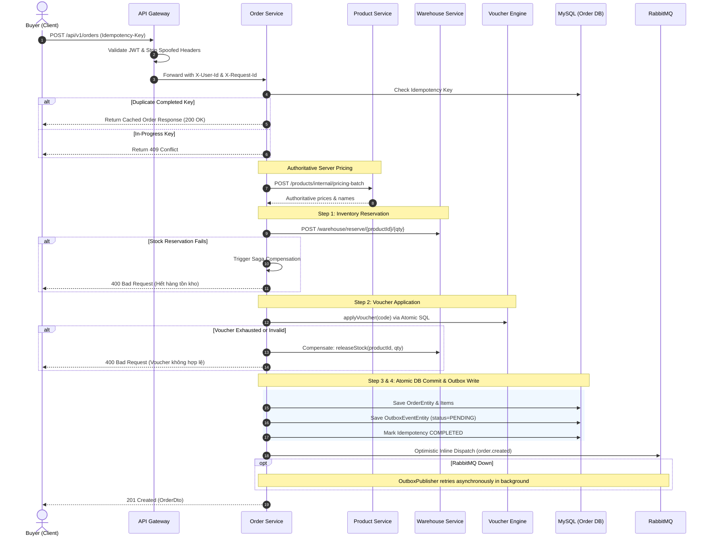
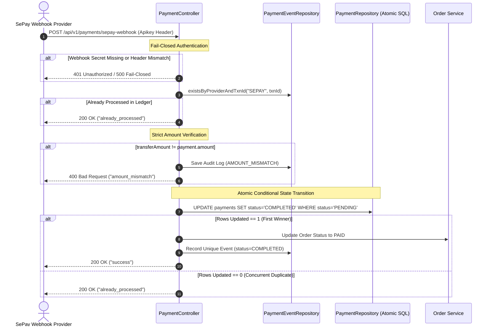

# 🚀 NexMart — Enterprise Distributed E-Commerce & B2B Platform

[](https://openjdk.org/)
[](https://spring.io/projects/spring-boot)
[](https://spring.io/projects/spring-cloud)
[](https://angular.dev/)
[](https://www.docker.com/)
[-success.svg)]()
[]()

**NexMart** is an original, production-ready, high-throughput **multi-vendor distributed e-commerce and B2B wholesale platform**. Designed from the ground up on modern microservices principles, NexMart implements mission-critical financial safeguards, atomic concurrency controls, real-time social commerce, automated seller settlement, and enterprise multi-warehouse logistics.

---

## 🌟 Key Platform Capabilities

- **Multi-Vendor Marketplace & Seller Isolation**: Independent merchant storefronts, shop-specific voucher campaigns, seller order management, and dedicated shop analytics.
- **Automated Seller Commission & Payout (`settlement-service`)**: Category-based commission rules, automatic period reconciliation upon delivery, and multi-tier payout approval workflows.
- **Enterprise B2B Wholesale Engine (`b2b-service`)**: Verified corporate profiles, tiered bulk pricing matrices, and internal Purchase Order (PO) approval flows with automated VAT calculation.
- **Live / Social Commerce (`live-service`)**: Real-time live broadcasting sessions, interactive product pinning, flash deals with purchase quotas, and millisecond Quick-Buy checkout.
- **Advanced RMA & Return Lifecycle (`order-service`)**: Formal Return Merchandise Authorization finite-state machine (`RMA_REQUESTED` → `QC_INSPECTION` → `REFUND / EXCHANGE`), warehouse intake, and anti-abuse safeguards.
- **Multi-Payment Hub & Digital Ledger (`payment-service`)**: Automated VietQR integration via SePay webhooks, cryptographic 16-character Gift Card engine, and transactional Store Credit wallet.
- **Loyalty & Premium Membership (`auth-service`)**: Tiered loyalty point accruals with automated cancellation/refund compensation, and NexMart PRO subscription with monthly freeship quotas.
- **Multi-Warehouse Fulfillment (`warehouse-service`)**: Regional allocation algorithm (North, Central, South) with intelligent fallback and atomic SQL row reservation preventing inventory overselling.
- **Real-Time Interactive Chat & Shopping Bot (`chat-service`)**: Ephemeral WebSocket/STOMP chat with automated shopping assistant FAQ bot for instant customer service.

---

## 🏗️ System Architecture

The architecture consists of **18 modular microservices** orchestrated via **Spring Cloud Gateway**, **OpenFeign**, and **RabbitMQ**:

```
                              ┌────────────────────────────────────────┐
                              │       Angular 17 SPA (Port 4201)       │
                              └───────────────────┬────────────────────┘
                                                  │
                                                  ▼ (Authorization: Bearer <JWT>)
                              ┌────────────────────────────────────────┐
                              │   Spring Cloud API Gateway (Port 8080) │
                              └───────────────────┬────────────────────┘
                                                  │
        ┌─────────────────────────────────────────┼─────────────────────────────────────────┐
        ▼                                         ▼                                         ▼
┌───────────────────┐                     ┌───────────────────┐                     ┌───────────────────┐
│   Core Commerce   │                     │  Seller & Growth  │                     │Advanced Operations│
├───────────────────┤                     ├───────────────────┤                     ├───────────────────┤
│ • Auth (8082)     │                     │ • Shop (8086)     │                     │ • Settlement(8094)│
│ • Product (8081)  │                     │ • Analytics (8090)│                     │ • B2B (8095)      │
│ • Cart (8085)     │                     │ • Settlement(8094)│                     │ • Live (8096)     │
│ • Order (8083)    │                     │ • Marketing (8087)│                     │ • RMA Engine      │
│ • Payment (8084)  │                     │ • Chat Bot (8091) │                     │ • Multi-Warehouse │
│ • Warehouse(8092) │                     │ • Review (8089)   │                     │ • Fraud Detection │
└───────────────────┘                     └───────────────────┘                     └───────────────────┘
        │                                         │                                         │
        └─────────────────────────────────────────┴─────────────────────────────────────────┘
                                                  │
                                  Async Events (RabbitMQ 5672)
                                  Caches & State (Redis 6379)
                                  Databases (MySQL 8.0 / Port 3307)
```

### Microservice Directory

| Service | Port | Primary Responsibility |
|---|---|---|
| **`gateway`** | `8080` | Reverse proxy, JWT validation, header sanitization, rate limiting, and global routing |
| **`auth`** | `8082` | User identity, OAuth 2.0 (Google/FB), TOTP 2FA, NexMart PRO subscriptions, audit logs |
| **`product`** | `8081` | Product catalog, categories, brands, cross-device compare sync, flash sale validation |
| **`cart`** | `8085` | High-performance cart management, precision pricing, guest-to-user cart merge |
| **`order`** | `8083` | Order state machine, RMA return lifecycle, real-time tracking, e-invoicing, fraud signals |
| **`payment`** | `8084` | Payment processing, SePay VietQR webhook, Gift Cards, Store Credit transactional ledger |
| **`warehouse`** | `8092` | Multi-warehouse inventory, regional fulfillment routing, atomic reservation engine |
| **`shop`** | `8086` | Multi-vendor seller onboarding, merchant verification, store profile management |
| **`settlement`** | `8094` | Automated merchant commission rules, reconciliation, period payout approvals |
| **`b2b`** | `8095` | Corporate account registration, tiered volume pricing, Purchase Order (PO) workflow |
| **`live`** | `8096` | Live commerce broadcasting, dynamic product pinning, quick-buy token generation |
| **`review`** | `8089` | Verified buyer reviews, ratings calculation, public shop reply capability |
| **`notification`**| `8088` | WebSocket push alerts, back-in-stock notifications, email dispatch |
| **`analytics`** | `8090` | Rule-based recommendation engine (FBT & Best-Sellers), merchant sales metrics |
| **`chat`** | `8091` | Real-time STOMP messaging, XSS sanitization, rate limiting, and shopping assistant bot |
| **`template`** | `8087` | Marketing banner management and dynamic campaign landing templates |

---

## 🔐 Security & Concurrency Safeguards

1. **Gateway Header Stripping & Anti-Spoofing**:
   - The API Gateway strictly purges incoming client-supplied identity headers (`X-User-Id`, `X-User-Role`, `X-Username`).
   - Trusted headers are cryptographically injected only after valid RSA/HMAC JWT signature verification.
   - External access to internal service-to-service endpoints (`/**/internal/**`) is blocked at Gateway level (`403 Forbidden`).
2. **Zero-Trust Authoritative Server Pricing & Snapshot**:
   - Client-sent unit prices are strictly ignored to prevent client-side price tampering.
   - Prices, product titles, and vendor ownership are fetched authoritatively from `product-service` and snapshotted immutably on order items.
3. **Zero Overselling Concurrency Engine**:
   - Stock allocations utilize atomic conditional SQL queries:
     `UPDATE inventory SET reserved_quantity = reserved_quantity + :qty WHERE quantity - reserved_quantity >= :qty`
   - Validated via 50-thread high-concurrency race condition tests (`WarehouseConcurrencyTest`).
4. **Checkout Saga Orchestration & Automatic Compensation**:
   - 4-step forward transaction: Inventory Reservation → Voucher Claim → Points Deduction → Atomic DB & Outbox Commit.
   - Any mid-flight failure automatically triggers inverse compensating actions (releasing reserved stocks, returning vouchers, and refunding points).
5. **Transactional Outbox Pattern**:
   - Domain events (`order.created`) are written to `outbox_events` in the same database transaction as the order.
   - Inline optimistic delivery with asynchronous background poller (`OutboxPublisher`) guarantees at-least-once delivery with zero phantom events.
6. **Payment Webhook Idempotency & Audit Ledger**:
   - Constant-time secret comparison (`MessageDigest.isEqual`) with fail-closed security.
   - Atomic database status transition (`UPDATE payments SET status = 'COMPLETED' WHERE status = 'PENDING'`).
   - Unique composite index `(provider, provider_txn_id)` in `payment_events` rejects concurrent replays cleanly (`already_processed`).

---

## 📐 Architecture Sequence Diagrams

### 1. Checkout Saga with Compensation & Transactional Outbox



### 2. Idempotent Payment Webhook Processing (SePay VietQR)



---

## 🏛️ Architecture Decision Records (ADRs)

Key architectural decisions, trade-offs, and design rationales are documented in [`docs/adr/`](docs/adr/):

- [ADR 0001: Distributed Checkout Saga Orchestration and Transactional Outbox Pattern](docs/adr/0001-checkout-saga-and-outbox.md)
- [ADR 0002: Authoritative Server-Side Pricing and Immutable Catalog Snapshot](docs/adr/0002-authoritative-pricing-and-catalog-snapshot.md)
- [ADR 0003: Idempotent Payment Webhook Processing and Atomic Ledger Auditing](docs/adr/0003-idempotent-payment-webhook-processing.md)
- [ADR 0004: Zero-Trust Gateway Security and End-to-End Distributed Tracing](docs/adr/0004-distributed-tracing-and-zero-trust-gateway.md)

---

## 🔍 Engineering Transparency: Real vs. Simulated

To uphold technical honesty, the table below clarifies which platform components are **production-grade implementations** versus **simulated environments**:

| Capability | Real Production Implementation | Simulated / Sandbox Scope |
|---|---|---|
| **Inventory Concurrency** | **Real**: Atomic SQL reservation with `tryReserveStock` tested under 50-thread concurrent load without overselling. | None (runs real database locking). |
| **Checkout Saga & Outbox** | **Real**: Saga state machine with compensation rollback + DB-backed `outbox_events` and background `OutboxPublisher`. | None. |
| **Idempotency Engine** | **Real**: DB-backed `order_idempotency_keys` table with SHA-256 request hashing and 409 conflict detection. | None. |
| **Banking Webhook (SePay)** | **Real**: Constant-time key comparison, amount matching, atomic conditional status change, and unique event ledger. | Webhook simulation calls VietQR sandbox endpoints rather than direct live commercial bank API. |
| **Message Broker** | **Real**: Standard AMQP event routing, exchanges, and queue bindings. | Single-node RabbitMQ in Docker Compose (enterprise multi-node cluster recommended for cloud prod). |
| **Search Engine** | **Real**: Elasticsearch 8 client integration for product full-text query. | Single-node ES container with memory limit tuning for local development. |

---

## 🛠️ Technology Stack

- **Backend Architecture**:
  - **Language & Runtime**: Java 17 / 21 LTS
  - **Framework**: Spring Boot 3.2.x, Spring Cloud 2023.0.x
  - **Data & Persistence**: Spring Data JPA, Hibernate 6, MySQL 8.0, Redis 7
  - **Inter-Service Communication**: OpenFeign, Spring Cloud Gateway, RabbitMQ (AMQP)
  - **Security**: Spring Security, JJWT (io.jsonwebtoken), TOTP 2FA
- **Frontend Architecture**:
  - **Framework**: Angular 17+ (Standalone Components, Signals)
  - **UI Design System**: Vanilla CSS Design Tokens, Bootstrap 5, Ng-Zorro Ant Design
  - **State & Communication**: RxJS, Angular HTTP Interceptors

---

## 🚀 Getting Started

### Prerequisites
- **Docker** 24+ and **Docker Compose** v2+
- **Java JDK** 17+ & **Maven** 3.8+
- **Node.js** 18+ & **npm** 9+

### Environment Configuration
Copy the provided environment template and configure secure secrets before running:
```bash
cp .env.example .env
```

### Running the Platform with Docker Compose

```bash
# 1. Start all databases, message brokers, and microservices
docker compose up -d

# 2. Verify container health status
docker compose ps
```

### Application URLs
- **Web Storefront (Frontend)**: `http://localhost:4201`
- **API Gateway**: `http://localhost:8080`
- **RabbitMQ Dashboard**: `http://localhost:15672` *(admin / admin123)*
- **MySQL Database**: `localhost:3307` *(sa / 123)*

---

## 🧪 Comprehensive Automated Testing

NexMart enforces a zero-regression policy. The monorepo features **300+ automated unit, security, and high-concurrency tests** passing with 100% success:

```bash
# Run test suite across backend microservices
cd backend
mvn test
```

### Key Concurrency Test Highlights
- **`WarehouseConcurrencyTest`**: 50 concurrent threads simultaneously contending for 10 items. Result: Exactly 10 succeed, 40 fail, remaining stock = 0.
- **`VoucherConcurrencyTest`**: 30 concurrent threads contending for a voucher with `maxUsage = 5`. Result: Exactly 5 succeed, 25 fail, `usedCount = 5`.
- **`PaymentControllerTest (Concurrency)`**: 10 concurrent webhook requests with identical transaction ID. Result: Exactly 1 triggers payment completion, 9 return `already_processed`.

### Frontend Build Verification
```bash
cd frontend
npm run build
```

---

## 📄 License

This project is licensed under the MIT License — see the [LICENSE](LICENSE) file for details.
